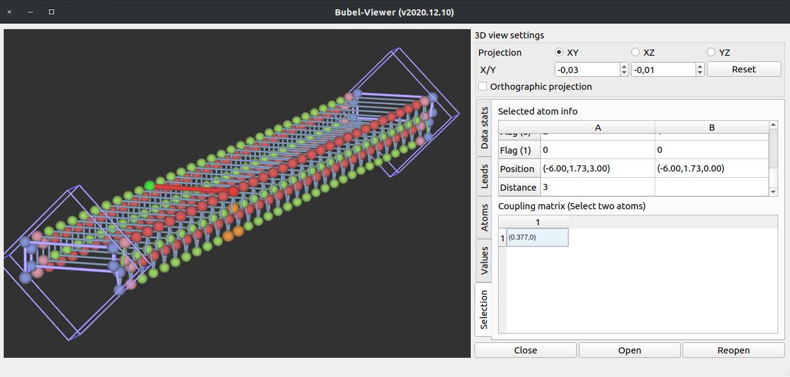
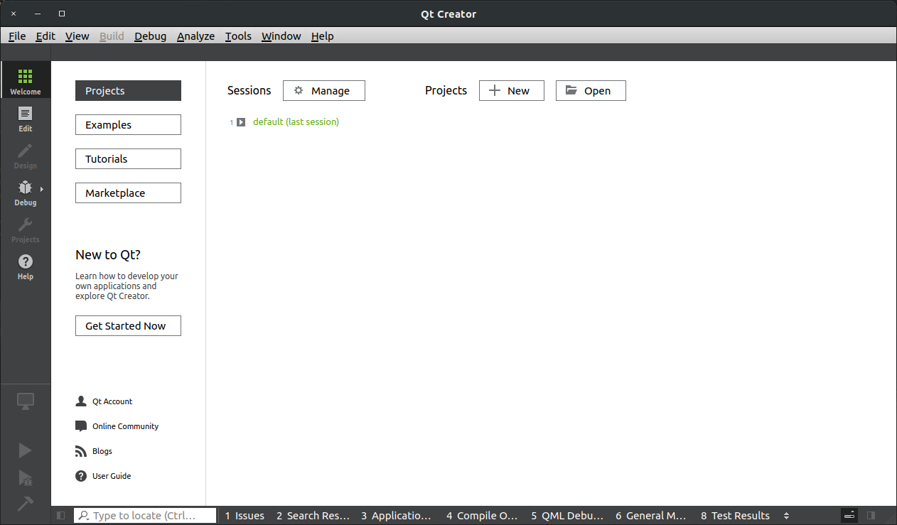
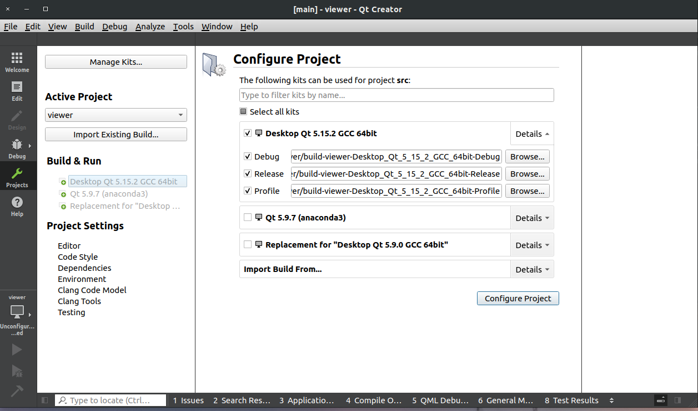
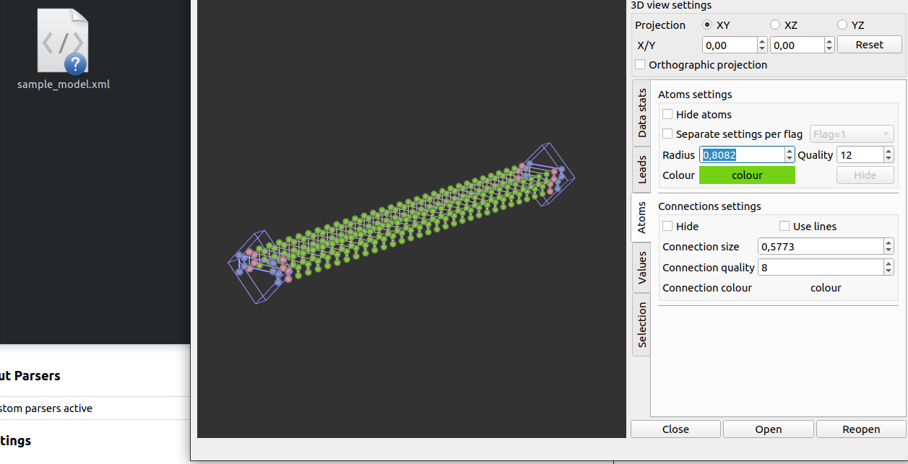

# Bubel-Viewer 2020-12-11

A simple 3D visualization tool for tight binding models



# Data format

## Representing Tight-Bingding system

Viewer can read XML file which has following structure which uses XML format. For 
the reference see the system0_lattice.xml file. 

```xml
# content of the system.xml file
<system>
<lattice>
  <atoms>
    <d>POS_X POS_Y POS_Z FLAG_0 FLAG_1 FLAG_2 ACTIVE NUM_ORBITALS NUM_BOUNDS</d>
    ...
  </atoms>
<connections>
  <d>FROM_ATOM_ID TO_ADOM_ID FROM_ORBITAL_I TO_ORBITAL_J RE_VALUE IM_VALUE</d>
  ...
</connections>
</lattice>

<lead>
  <LEAD_DATA/> ==> See explanation below
  <vector>
        LEAD_DIRECTION_VECTOR_X LEAD_DIRECTION_VECTOR_Y LEAD_DIRECTION_VECTOR_Z
  </vector>
  <atoms>
   <d> ATOM_ID </d>
    ...
  </atoms>
  <next_atoms>
   <d> ATOM_ID </d>
   ...
  </next_atoms>
  <lead_coupling>
     <d>FROM_ATOM_ID TO_ADOM_ID FROM_ORBITAL_I TO_ORBITAL_J</d>
      ...
  </lead_coupling>
  <inner_coupling>
     <d>FROM_ATOM_ID TO_ADOM_ID FROM_ORBITAL_I TO_ORBITAL_J</d>
      ...
  </inner_coupling>
</lead>
</system>

```

### Definitions:

Atom defintion:

* `POS_X POS_Y POS_Z` - a three float numbers denoting 3D position of the k-th atom
* `FLAG_0` - extra integer parameter which allows to distinguish atoms e.g. from different sub-latticies, can be used 
  to control the rendering color of the atoms with different flagsm which may help in debugging.
* `FLAG_1` - extra integer parameter which will be displayed in the Viewer
* `FLAG_2` - extra integer parameter which will be displayed in the Viewer
* `ACTIVE` - a number (0, 1), in most cases this value should be set to 1. 
* `NUM_ORBITALS` - a number of degress of freedom e.g. spin-orbitals 
* `NUM_BOUNDS` - a number of connections between other atoms

Coupling definition (a graph egde):

* `FROM_ATOM_ID` - integer index of the source atom in the atoms list (**starting from 1**) 
* `TO_ADOM_ID` - integer index of the target atom in the atoms list (**starting from 1**)
* `FROM_ORBITAL_I` - a number between (1, ATOMS[FROM_ATOM_ID].NUM_ORBITALS) denoting the coupling between possible degress of freedom
* `TO_ORBITAL_J`  - a number between (1, ATOMS[TO_ADOM_ID].NUM_ORBITALS) denoting the coupling between possible degress of freedom
* `RE_VALUE IM_VALUE` - two float numbers denoting coupling value Re(coupling_value) Im(coupling_value) between from and to atoms and their orobitals.

Lead definition (this section is optional in the XML) it allows to render extra information about translational invariant leads
used in the Quantum Transport problems. 

* `<LEAD_DATA/>` - XML data with lead shape definition, see section below for avaiable options
* `LEAD_DIRECTION_VECTOR_X LEAD_DIRECTION_VECTOR_Y LEAD_DIRECTION_VECTOR_Z` - lead direction vector a unit cell translation vector
* `<atoms>` - `ATOM_ID` - index of the atom which belongs to the lead part from the global atoms list, enumrated from 1. 
* `<next_atoms>` - `ATOM_ID` - index of the atom which belongs to the lead part, but comes from the next unit cell, from the global atoms list, enumrated from 1. 
* `<lead_coupling>` - `FROM_ATOM_ID TO_ADOM_ID FROM_ORBITAL_I TO_ORBITAL_J` - integer values with graph defintion for connections between lead atoms and next unit cell.
* `<lead_coupling>` - `FROM_ATOM_ID TO_ADOM_ID FROM_ORBITAL_I TO_ORBITAL_J` - integer values with graph defintion for connections inside unit cell. 


### <LEAD_DATA/> 
Lead type depends on the Lead definition and will affect the rendering of
the lead in the viewer. Currently supported shape_type are:

* SHAPE_RECTANGLE_XY - lead definition valid for 2D systems i.e. a bounding box of the lead atoms in the XY plane. 
  ```xml
      <shape_type>SHAPE_RECTANGLE_XY</shape_type>
      <shape_data>
        X_MIN Y_MIN X_MAX Y_MAX
      </shape_data>
  ```
* SHAPE_RANGE_3D - describe lead by its base position point and the unit cell translation vector
  ```xml
      <shape_type>SHAPE_RECTANGLE_XY</shape_type>
      <shape_data>
        BASE_POS_X BASE_POS_Y BASE_POS_Z LEAD_DIRECTION_VECTOR_X LEAD_DIRECTION_VECTOR_Y LEAD_DIRECTION_VECTOR_Z
      </shape_data>
  ```

## Rendering onsite data

TODO - viewer has limited possibilies to render onside data like electron density, see example file: system0_densities1.xml for 
required structure. 


# Building the Source Code

## Requirements

The application has been tested on linux Ubuntu 18 LTS system, however since it 
is purely written in Qt a crossplatform it should also work on other systems.

Program has been compiled with:
* Qt 5.15.2 GCC 64bit
* Additional OpenGL related libraries may be required for building, for linux see e.g. this [thread](https://forum.qt.io/topic/50865/gl-gl-h-not-found-in-linux/10)

## Builing steps 

* The application must be compiled from source 
* Download and install QtCreator - https://www.qt.io/download (follow "Downloads for open source users")
* Start QtCreator application
* Select **Open Project** and navigate to **bubel-viewer/src/viewer.pro** file.



* Select supported by your system compiler and press **Configure Project**



* Build Project (optionally switch to the Release mode for greater performance) by pressing **hammer button** in the bottom-left corner.



* After compilation Run application, by clicking green **play button** in the bottom-left corner. 

* Navigate to the sample model folder and drag and drop "samples/sample_model.xml" file into viewer window it should open the 
file with simple thight-binding model. 

* After this step, you can find binary file **viewer** or **viewer.exe** in the **bubel/viewer/build-viewer-.../**  folder. 
You should be able to run viewer by double clicking on this icon. 


